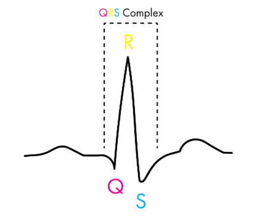

# Data606_CapstoneProject

# Understanding Physiological and Neurological Fingerprint for Decision Making with Food Choices in Virtual Reality Environment 

INTRODUCTION:

 The emergence of dysfunctional eating behavior and eating disorders starts in adolescence and young adulthood. Epidemiological studies has revealed a strong association between disordered eating behavior (e.g., binge eating), overweight and obesity-related health consequences. This weight gain is observed most during the age of transition to college, where young adults have more independent food and diet-related decisions. In the United States, 30% of individuals seeking weight loss treatment suffer from binge eating disorder (BED), which occurs in over 40% of obese individuals with a body mass index (BMI) > 34. Thus, there is a need to examine food and eating related processes during this developmental period among students attending college and ultimately developing effective treatment for individuals with eating disorders. 
 
PREVIOUS WORK:

 This Project is an advancement of pre-existing projects on Validation of Virtual Reality Buffet Environment and Neurophysiological Variations in Food Decision Making within Virtual and Real Environments from the departments of Psychology and Information Systems at UMBC. 
Validation of a Virtual Reality Buffet environment to assess food selection processes among emerging adults: 
Primary aim of the above study was to assess convergent validity by examining the correlations between the nutritional content of participants food selections in the VR buffet and their RW food buffet selection (in Kcals, grams, fat, carbohydrates, protein) one-week apart. The second aim was to assess user experience in the VR environment. Specifically, examined participants’ perceptions of the VR buffet in terms of: (a) how natural was their overall experience in the VR buffet; (b) how much their final selection in the VR buffet represented a lunch that they would select and eat/drink on an average day; and (c) how much their final selection represented the lunch that they would select and eat/drink if the same food selection were available. 
   
Findings demonstrated the validity and acceptability of a highly immersive and realistic VR buffet for assessing food selection that is generalizable to RW food settings. 
Neurophysiological Variations in Food Decision Making within Virtual and Real Environments: 

This research presents a pilot study to achieve a long-term goal by designing and developing experimental environments, protocols and methods to examine the multifactorial neurophysiological correlates of food decision-making behavior, with potential implications for the development of effective treatments for individuals with dysfunctional eating. The experimental protocol was designed in a virtual reality (VR) and real-life (RL) buffet setting. The main aim was to identify what are the neurophysiological correlates of food decision-making behaviors within the VR and the RL buffet setting? How consistent are individuals’ food decision-making processes in the VR setting and the RL buffet setting? 
Findings revealed that the left inferior frontal gyrus demonstrated significant differential activation when subjects chose high compared to low density food in both settings. These findings suggest that VR simulations may provide similar neural responses to real world environments, particularly in control regions of the brain. 

AIM:

The objective of this project is to explore the physiological signals collected from wearable Sensors and VR headsets in order to understand and predict how they could characterize and explain the cognitive processes involved in the food-related decision making in a Virtual Reality Buffet. Formulate machine learning model Time Series analysis to discriminate event periods using the Neurophysiological features, e.g. resting vs activation, food selection and non-food selection, high-density vs low-density food. Secondary objective is to quantify the complementary and temporal dynamics of physiological signals to inform future experiments and data collection.

DATA:

Collection:
To assess the food decision-making processes in both environments, behavioral assessments and quantitative measurements were adopted, including questionnaires and various sensing modalities such as electrocardiography (ECG), galvanic skin response (GSR), eye movement and body motion. Neurophysiological measures were captured in both VR and RL phases of the study. In the VR setting, participants’ physiological signals, including heart rate (ECG), GSR and position were measured using Shimmer wearable sensors. In both the VR and RL setting, Microsoft band was also used to capture skin temperature, heart rate (PPG), GSR, accelerometer and gyroscope data.  Furthermore, the nutrition density of the food which participants chose in both environments was calculated and categorized into two groups (high and low-density). Then, data processing techniques were developed to identify the neurophysiological variations with different food choices (high/low density) in both environments. There are 15 Participants involved in VR and RW data collection process, which are collected one week apart. 
Explanation and EDA:

There are certain tasks involved to prior and post the data collection process for better understanding of participants state of mind.
1.	Hunger Emotion Rating - to know how hungry the participant is.
2.	Baseline Task - to obtain the baseline of heart rate.
3.	Go / no-Go Task - to practice and instruct the participants about VR setting and Data collection.
4.	Speech Emotion Task - Surprise participants and ask to talk about their strength and weakness, which can help understand their physical and mental state. 
5.	VR and RW food selection task.
6.	Review Questionnaire.

Comprising all of these together we have a TIMESTAMP DATA, recording the start and end times of above events, which helps to data instances from respective interval to analyze particular task.

Shimmer's Data (Physiological Data):

To analyze the physiological behavior, they have used Shimmer's sensors and Microsoft band to detect the motion using Accelerometer, GSR (Galvanic Skin Response) to sense skin gland activity, ECG (Electrocardiography) to know the heart rate and Gyroscope to sense movement.

I have worked on two different types of Physiological data collected using shimmer device. 
1. GSR Data (Galvanic Skin Response) measures the skin conductance of sweat gland activity
2. ECG Data (Eclectro Cardio Graph) helps to measure the heart rate variability 

Our goal here is to understand Stress Indicating Factors (GSR&ECG) and discriminate each event period using the features extracted from GSR & ECG:

Below is the Image representing three different event periods namely VR Baseline, Speech Emotion and Food Selection on a sample GSR signal.

GSR or Electrodermal Activity:

GSR is used to measure sweat gland activity related to emotional arousal, it refers to variation of electric conductance of the skin in response to skin secretion. 

Two major components of GSR signal are:

Skin Conductance Response (SCR): Also called the Phasic component, it refers to the number of sweat glands that are activated. SCRs are faster in their appearance and takes longer to decline to baseline, which means that another SCR occurs shortly one after another resulting in an overall increase in GSR activity. This cumulative effect leads to the underestimation of SCR amplitude.

The Rapid rise and asymptomatic exponential decay are the main characteristics of this signal and the overlap issue is the main problem in the decomposition of these signals.

a. SCR occurs in response to a stimulus which is an event.

b. NS-SCR- non-specific SCR occurs without any specific reason.

Skin Conductance Level (SCL): Also called the Tonic component, is a slowly changing and continuous signal. Slow drifts in baseline and spontaneous fluctuations are the characters of this signal.

Below is the image discriminating raw GSR signal and its Phasic and Tonic components.

The central problem in the analysis of the GSR signal is to separate these two signals using signal decomposition techniques. To carry out this operation of Decomposing raw GSR signal into Phasic and Tonic components, I have worked with two different tools from MATLAB and Python.

Ledalab is software built on top of MATLAB. This software uses the Convolution Decomposition technique to separate Phasic and Tonic components. This is a drag-and-drop software that is efficient when a single file is processed, but when it is automated and all the files are processed sequentially, it took long sessions to give output, which is why I used Convex Optimization from Python.

To extract these features we need to deocmpose the Raw GSR signal so that we can extract phasic and tonic components. I have used convex optimization technique from the neurokit.py module in python. To learn more about this method go to Greco2015cvxEDA.pdf or http://cvxopt.org/userguide/solvers.html#problems-with-nonlinear-objectives.
Prior to that I have downsampled the signal by a factor of 8 to 16Hz and smoothened and normalized using EWM average and MinMax Scaler.

a. Downsampling by the factor of 8 (128Hz-16Hz ).

b. Normalization and Estimated weighted moving average to smoothen and filter downsampled signal.

c. Run the processed signal through different functions from Neurokit.py using CVxOPT method by setting various parameters resulting in Phasic and Tonic components.
Following Image shows how chnage in event period chnage sthe amplitude of Phasic and Tonic components. Though Phasic component is in response to the stimuli, tonic component also exhibits similar chnages in event period chnage.

Feature-Based Learning  (Time Series Analysis):

Though various research suggests that Multi-variate analysis using VAR and LSTM on time series data could give better predictions, but converting a sequential set of measures to feature vectors better captures global and dynamic properties of time series. Instead of deriving from the shapes of time series subsequences, understanding comes from time-series patterns, discriminating time series intervals that perfectly suit our classification problem.

Feature Extraction from Processed GSR:

Next, we have to proceed further to understand and discriminate three different events using stress indicators factors that is, to extract various statistical features from a processed signal. Few of the statistical features include  Mean, SD, Peaks, Mean, Median, AUC, Slope, etcetera.

I have extracted features from the Phasic and Tonic components of GSR signals using a Sliding window technique with an overlap of 50 and a window length of 100. 
Images representing Number of features extracted for each subject(1st column is Subject_ID)

ECG or Electro Cardio Graph:

This is heart related data and HRV features extracted from these signals are helpful to understand the stress analysis suring food selection process.
Figure classifying QRS complex in a heart signal.

HRV is the Heart Rate Variability computed using the location og R peaks present in the ECG signal. After extracting R peaks locations in a GSR signal, I have used sliding window technique with window length of 60 and overlap of 30 to extract hev features. I have used hrv_time() function from python neurokit.py module to extract HRV features from ECG signal where R peaks are located. https://neurokit2.readthedocs.io/en/latest/functions.html#module-neurokit2.hrv
Image representing how Event period is effecting the HRV in individuals, you can clearly see increase in stress reduces HRV during Speech emotion task.

Images representing Number of features extracted for each subject(1st column is Subject_ID)

Modeling using Cross-Validation:

I have labeled each feature parameter with a respective event at that particular timestamp using the time stamp data and carried out binary classification on VR Baseline, Speech Emotion, and VR Food Selection events conducting three different experiments using K-Fold CV to discriminate among the events. Experiments namely,

a. VR Baseline vs Speech Emotion

b. Speech Emotion vs VR Food Selection

c. VR Baseline vs VR Food Selection

Prediction Analysis:

GSR Feature Predictions:

1- We have carried out predictions to understand which features are better predciting the event period. Tried training models on Phasic&Tonic, just Phasic and just Tonic.
Random forest model with 13 fold cross validation trained on both Phasic&Tonic data have predicted better results when compared to just Phasic and just Tonic models.

2- Experiment VR Baseline vs Speech Emotion have better predicted when compared to other two experiments.

3- Also analysis on the individual subjects using Leave One Group Out helps to understand indivudal behaviour of subjects which indeed performed poor when compared to KFold CV when all the subjects combined.

Figure representing the Event wise discrimination of algorithms predicting the AUC score:

HRV Feature Predictions:

1-Similar to GSR Data HRV also exhibited the same out come, Kfold cross val with Random Forest on the VR Baseline vs Speech Emotion experiment have worked better than other algorithms and experiments.

2- Also the individuals predictions have been similar to GSR but we can observe little but of stability among all the subjects during experiment VR Baseline vs Speech Emotion.
Figure representing the Event wise discrimination of algorithms predicting the AUC score:

Out Comes:
1. Understanding and knowing whether GSR and ECG data are useful to analyze stress.
2. Effect of different features.
3. Confirmations for further research.

Future Proceedings:
1. Go to Task is to merge GSR and HRV features together and analyze results.
2. Working on other psychological features and collecting more data.

